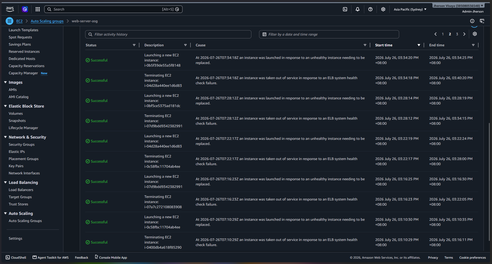
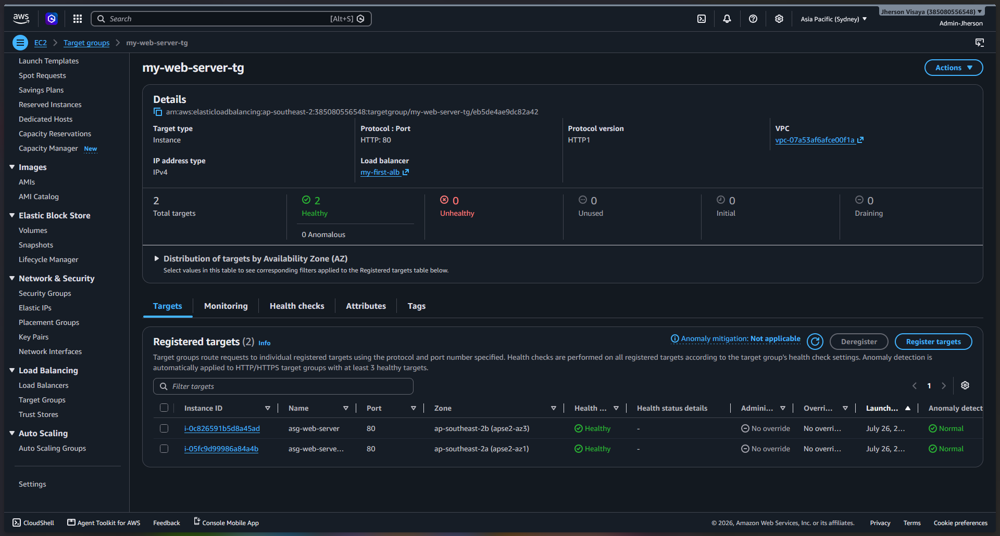
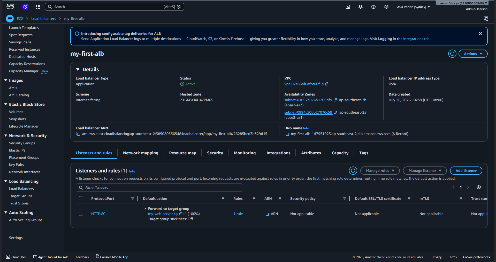

# Resilient Two-Tier Web Application on AWS

A hands-on AWS infrastructure project: a custom VPC hosting a self-healing, load-balanced web tier and a private, isolated MySQL database. The web tier automatically scales, replaces failed instances without human intervention, and is only reachable through a Load Balancer — never directly. The database is only reachable by identity (Security Group reference), never by IP.

## Architecture Overview

```
                        Internet
                            │
                    ┌───────▼─────────┐
                    │ Internet Gateway│
                    └───────┬─────────┘
                            │
                 ┌──────────▼──────────┐
                 │   Route Table       │
                 │   0.0.0.0/0 → IGW   │
                 └──────────┬──────────┘
                            │
        ┌─────────────────────────────────────────────┐
        │              VPC (10.0.0.0/16)              │
        │                                             │
        │   ┌──────────────────────────────────┐      │
        │   │  Application Load Balancer       │      │
        │   │  (alb-sg — HTTP from anywhere)   │      │
        │   └──────────────┬───────────────────┘      │
        │                  │                          │
        │   ┌──────────────▼───────────────────────┐  │
        │   │  Public Subnets (2 AZs)              │  │
        │   │  10.0.1.0/24, 10.0.4.0/24            │  │
        │   │                                      │  │
        │   │  ┌─────────────────────────────────┐ │  │
        │   │  │  Auto Scaling Group             │ │  │
        │   │  │  Min: 2 / Desired: 2 / Max: 4   │ │  │
        │   │  │                                 │ │  │
        │   │  │  [EC2] [EC2]  ← self-healing    │ │  │
        │   │  │  (web-server-sg: HTTP from      │ │  │
        │   │  │   alb-sg only, no direct access)│ │  │
        │   │  └───────────┬─────────────────────┘ │  │
        │   └──────────────┼───────────────────────┘  │
        │                  │ MySQL (3306)             │
        │                  │ SG-to-SG reference       │
        │   ┌──────────────▼──────────────────┐       │
        │   │  Private Subnets (2 AZs)        │       │
        │   │  10.0.2.0/24, 10.0.3.0/24       │       │
        │   │                                 │       │
        │   │  ┌───────────────────┐          │       │
        │   │  │  RDS MySQL DB     │          │       │
        │   │  │  (db-sg)          │          │       │
        │   │  │  No public access │          │       │
        │   │  │  No IGW route     │          │       │
        │   │  └───────────────────┘          │       │
        │   └─────────────────────────────────┘       │
        └─────────────────────────────────────────────┘
```

## What This Project Demonstrates

- Designing a VPC from scratch rather than relying on AWS default networking
- Correctly separating public-facing and private resources across subnets
- Understanding that **a public IP does not equal internet reachability** — routing (Route Tables + Internet Gateway) is what actually determines it
- Identity-based access control: the database Security Group allows traffic from the **web server's Security Group**, not a hardcoded IP — meaning access remains valid even if the EC2 instance restarts and receives a new IP
- Meeting RDS's multi-AZ subnet requirement even for a single-instance deployment
- Real troubleshooting under production-like conditions (see below)

## Components Built

| Component                 | Configuration                                                                                                           |
| ------------------------- | ----------------------------------------------------------------------------------------------------------------------- |
| VPC                       | `10.0.0.0/16`                                                                                                           |
| Public Subnets            | `10.0.1.0/24`, `10.0.4.0/24` (two Availability Zones)                                                                   |
| Private Subnets           | `10.0.2.0/24`, `10.0.3.0/24` (two Availability Zones)                                                                   |
| Internet Gateway          | Attached to VPC, referenced in public route table                                                                       |
| Route Table               | `0.0.0.0/0 → IGW`, associated only with public subnets                                                                  |
| Application Load Balancer | Internet-facing, spans both public subnets                                                                              |
| Target Group              | HTTP:80, health checks on `/`, ELB health checks enabled                                                                |
| Auto Scaling Group        | Min 2 / Desired 2 / Max 4, spans both public subnets, attached to the ALB's Target Group                                |
| Launch Template           | Amazon Linux 2023, Apache install + auto-start via User Data script, Name tag auto-applied to new instances             |
| Security Group (ALB)      | Inbound: HTTP (80) from anywhere                                                                                        |
| Security Group (web)      | Inbound: HTTP (80) from the **ALB's Security Group only** — direct internet access blocked; SSH (22) from admin IP only |
| RDS Instance              | MySQL, private subnets, **no public access**                                                                            |
| Security Group (db)       | Inbound: MySQL (3306) — source restricted to the web server's Security Group                                            |
| DB Subnet Group           | Spans both private subnets across two AZs (RDS requirement)                                                             |


_The full network at a glance — VPC, public and private subnets, spanning two Availability Zones._

## Setup Steps

1. Created a custom VPC (`10.0.0.0/16`) instead of using the AWS default network
2. Created one public and two private subnets with non-overlapping CIDR blocks
3. Created and attached an Internet Gateway to the VPC
4. Built a Route Table directing `0.0.0.0/0` traffic to the Internet Gateway, and associated it _only_ with the public subnet — private subnets were deliberately left off this table

   
   _Routes: `0.0.0.0/0 → Internet Gateway` and `10.0.0.0/16 → local`._

   
   _Only the public subnet is explicitly associated — the private subnet has no route to the internet, by design._

5. Launched an EC2 instance into the public subnet with a Security Group allowing HTTP from anywhere and SSH restricted to a single admin IP
6. Connected via SSH, installed and configured Apache, deployed a custom HTML page

   
   _Inbound rules: SSH (22) restricted to admin IP, HTTP (80) open to all._

   
   _The live page, served from the EC2 instance in the public subnet._

7. Created a DB Subnet Group spanning two Availability Zones (an AWS requirement for RDS even with a single instance)
8. Created a dedicated database Security Group, with its inbound MySQL rule scoped to the **web server's Security Group** rather than an IP address

   
   _MySQL (3306) inbound rule sourced from the web server's Security Group — identity-based access, not an IP allowlist._

9. Launched an RDS MySQL instance into the private subnets with public access disabled
10. Connected to the RDS instance from the EC2 instance's terminal via the MySQL client, confirming the database was reachable only through the intended path

    
    _Connected from the EC2 instance and confirmed with `SHOW DATABASES;` — proof the full path (EC2 → SG reference → private RDS) works end to end._

## Adding Resilience: Load Balancer + Auto Scaling

The original single-EC2 setup above was a single point of failure — if that one instance crashed or got overwhelmed, the site went down. This phase removed that weakness.

1. Added a second public subnet in a different Availability Zone (Load Balancers and Auto Scaling Groups require spanning multiple AZs for the same reason RDS does — no single zone failure should take down the whole application)
2. Created a dedicated Security Group for the Load Balancer (`alb-sg`), allowing HTTP from anywhere
3. **Locked down the web server's Security Group** to only accept HTTP from `alb-sg` — closing off the ability to bypass the Load Balancer and hit an EC2 instance's IP directly
4. Created a Target Group and an Application Load Balancer spanning both public subnets
5. Built a Launch Template defining exactly how a replacement EC2 instance should be configured, including a User Data script that automatically installs and starts Apache the moment a new instance boots — no manual SSH setup required
6. Created an Auto Scaling Group (min 2, desired 2, max 4) attached to the Target Group, so every instance it launches is automatically registered behind the Load Balancer

   
   _The site now served through the Load Balancer's DNS name rather than any individual instance's IP._

### Real Debugging Along the Way

Three separate, non-obvious issues surfaced while wiring this together — each diagnosed from actual evidence (Target Group health details, system logs) rather than guesswork:

- **Missing inbound rule on `alb-sg`:** the Load Balancer showed "Reachability may be impacted" — its own Security Group had zero inbound rules, silently blocking all traffic despite the Load Balancer itself being Active and the Target healthy.
- **Wrong Security Group on the Launch Template:** new Auto Scaling instances failed health checks because the Launch Template had `alb-sg` attached instead of the web server's own Security Group — an easy mix-up, since both are valid Security Groups in the same VPC, but each represents a different resource's role.
- **Missing "Auto-assign public IP" on the Launch Template:** even after fixing the Security Group, new instances still failed — the system log showed `yum`/`cloud-init` timing out trying to reach Amazon's package repositories. The instances launched into a public subnet with correct routing, but without an assigned public IP they had no way to actually reach the internet to install Apache. This is the inverse of the classic "public IP without routing ≠ reachable" lesson: correct routing without a public IP ≠ able to reach _out_ either. Both directions need both pieces.

### Proving Self-Healing Actually Works

Rather than trusting the configuration alone, the Auto Scaling Group's self-healing was tested directly: one of the two running instances was manually terminated to simulate a crash.

**Observed behavior:**

- The Auto Scaling Group detected the drop below desired capacity within about a minute (visible in the Activity tab)
- A replacement instance launched automatically from the Launch Template, ran the User Data script, and registered itself with the Target Group
- The new instance progressed from `Initial` → `Healthy` without any manual intervention
- The site remained reachable throughout the entire test — the surviving instance kept serving traffic while the replacement came online


_Activity history showing paired "Terminating EC2 instance" → "Launching a new EC2 instance" events, each completing within seconds of the previous one — the Auto Scaling Group detecting and recovering from failure automatically, no manual intervention._


_Both instances registered and Healthy, spread across two different Availability Zones (ap-southeast-2a and ap-southeast-2b) — confirming the multi-AZ resilience is real, not just configured._


_The Application Load Balancer, Active and spanning both Availability Zones, forwarding all traffic to the Target Group._

This confirms the architecture doesn't just look correct on paper — it actually recovers from real failure automatically.

## Problems Encountered and Solved

Real troubleshooting is often more telling than a clean happy-path, so here's what actually came up:

- **Wrong Linux environment:** initially working inside Docker Desktop's internal WSL distro instead of a proper Ubuntu install, which silently broke access to the Windows filesystem. Diagnosed via `wsl -l -v` in PowerShell and switched to the correct distro.
- **Public IP does not mean reachable:** initially assumed enabling "auto-assign public IP" in a private subnet would make an instance internet-accessible. Corrected understanding: reachability is determined by the subnet's route table having a path to the Internet Gateway, not by whether the instance holds a public IP.
- **Security Group scope confusion:** initially proposed restricting the database's inbound rule to an admin's personal IP address. Corrected to reference the web server's Security Group instead, since IPs change on instance restart and a database should be reached by application logic, not a human directly.
- **SSH timeout after instance restart:** stopping and restarting the EC2 instance rotated its public IP, and separately, a since-changed home IP address invalidated the existing "My IP" SSH rule. Diagnosed by checking instance state first, then updating the Security Group's source to the current IP.
- **RDS authentication failure:** initial connection attempt failed with `Access denied for user 'admin'`. Root cause was using an assumed default username ("admin") instead of the actual master username configured at database creation — resolved by checking the RDS instance's Configuration tab for the correct value.

## Skills Applied

Linux CLI • AWS VPC design • Subnetting/CIDR • Security Groups • IAM • EC2 • RDS • Apache • MySQL • SSH key-based authentication • Application Load Balancers • Target Groups • Auto Scaling Groups • Launch Templates • User Data automation • Infrastructure troubleshooting • Git/GitHub

## Next Steps

- [x] ~~Add an Application Load Balancer and Auto Scaling Group in front of the EC2 tier~~ — done
- Automate this entire architecture with Infrastructure as Code (Terraform or CloudFormation) — one-command deploy/destroy
- Add a small serverless piece: a Python Lambda function triggered by an S3 upload event
- Add a custom domain via Route 53 pointing to the load balancer
