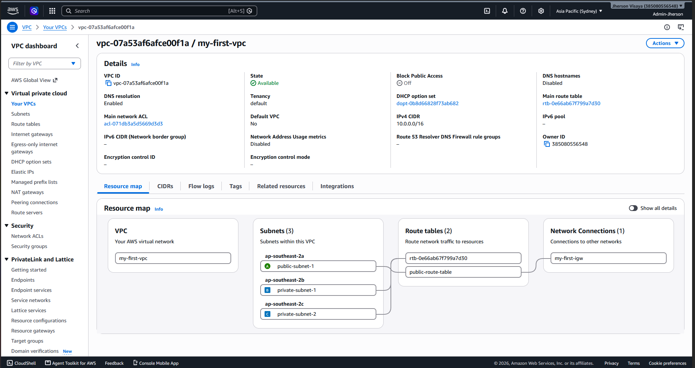
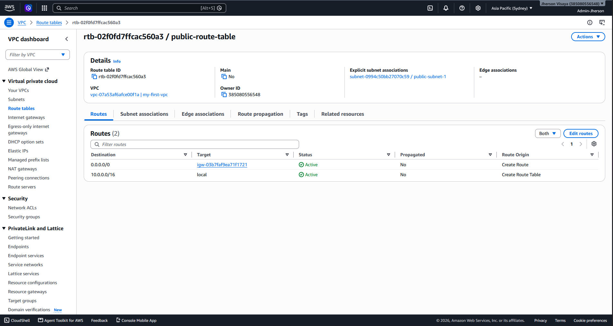
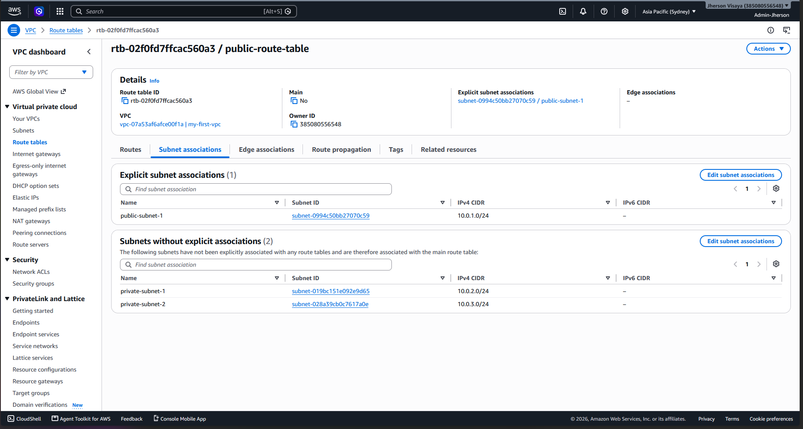
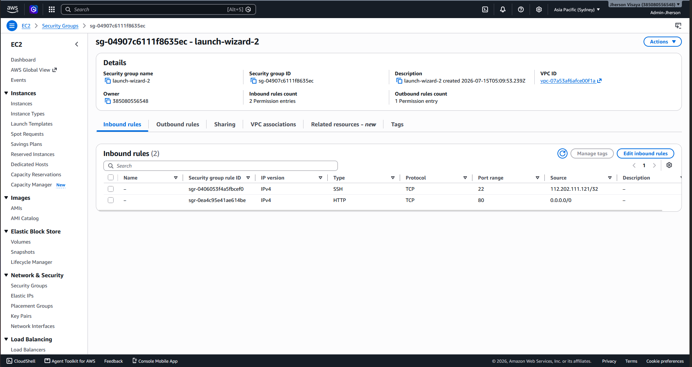
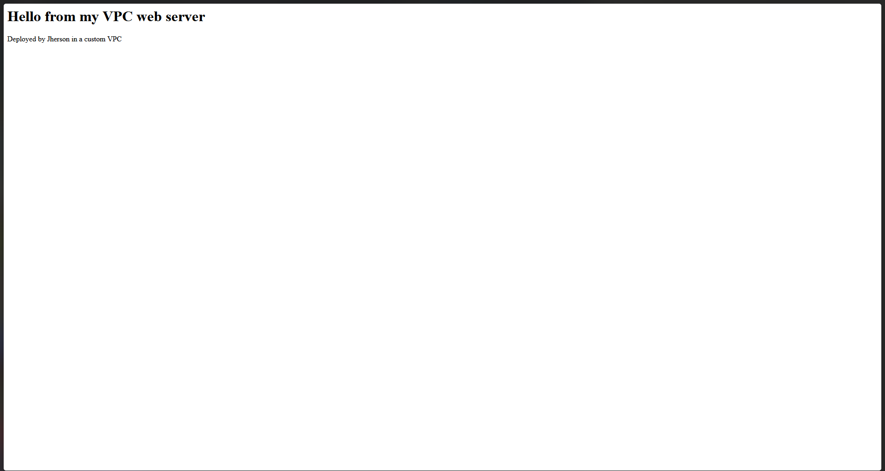
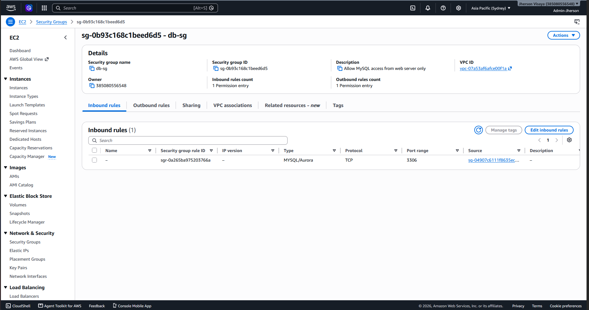
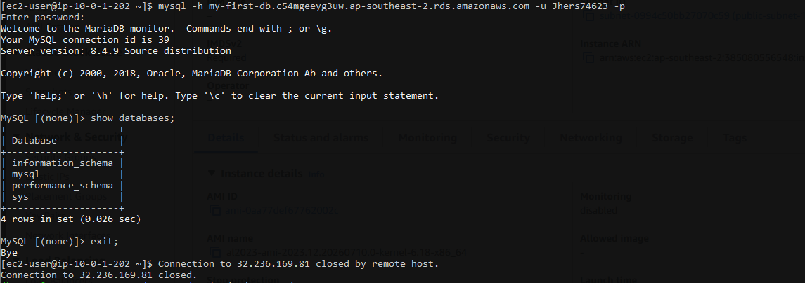

# Two-Tier Web Application Architecture on AWS

A hands-on AWS infrastructure project: a custom VPC hosting a public-facing web server and a private, isolated MySQL database, connected securely using identity-based (Security Group) access control instead of IP allowlisting.

## Architecture Overview

```
                        Internet
                            │
                    ┌───────▼─────────┐
                    │ Internet Gateway│
                    └───────┬─────────┘
                            │
                 ┌──────────▼──────────┐
                 │   Route Table       │
                 │   0.0.0.0/0 → IGW   │
                 └──────────┬──────────┘
                            │
        ┌────────────────────────────────────┐
        │         VPC (10.0.0.0/16)          │
        │                                    │
        │   ┌─────────────────────────┐      │
        │   │  Public Subnet          │      │
        │   │  10.0.1.0/24            │      │
        │   │                         │      │
        │   │  ┌─────────────────┐    │      │
        │   │  │  EC2 Instance   │    │      │
        │   │  │  Apache Server  │    │      │
        │   │  │  (web-server-sg)│    │      │
        │   │  └────────┬────────┘    │      │
        │   └───────────┼─────────────┘      │
        │               │ MySQL (3306)       │
        │               │ SG-to-SG reference │
        │   ┌───────────▼────────────────┐   │
        │   │  Private Subnets           │   │
        │   │  10.0.2.0/24, 10.0.3.0/24  │   │
        │   │  (2 AZs — RDS requirement) │   │
        │   │                            │   │
        │   │  ┌───────────────────┐     │   │
        │   │  │  RDS MySQL DB     │     │   │
        │   │  │  (db-sg)          │     │   │
        │   │  │  No public access │     │   │
        │   │  │  No IGW route     │     │   │
        │   │  └───────────────────┘     │   │
        │   └────────────────────────────┘   │
        └────────────────────────────────────┘
```

## What This Project Demonstrates

- Designing a VPC from scratch rather than relying on AWS default networking
- Correctly separating public-facing and private resources across subnets
- Understanding that **a public IP does not equal internet reachability** — routing (Route Tables + Internet Gateway) is what actually determines it
- Identity-based access control: the database Security Group allows traffic from the **web server's Security Group**, not a hardcoded IP — meaning access remains valid even if the EC2 instance restarts and receives a new IP
- Meeting RDS's multi-AZ subnet requirement even for a single-instance deployment
- Real troubleshooting under production-like conditions (see below)

## Components Built

| Component            | Configuration                                                                |
| -------------------- | ---------------------------------------------------------------------------- |
| VPC                  | `10.0.0.0/16`                                                                |
| Public Subnet        | `10.0.1.0/24`                                                                |
| Private Subnets      | `10.0.2.0/24`, `10.0.3.0/24` (two Availability Zones)                        |
| Internet Gateway     | Attached to VPC, referenced in public route table                            |
| Route Table          | `0.0.0.0/0 → IGW`, associated only with the public subnet                    |
| EC2 Instance         | Amazon Linux 2023, Apache (`httpd`), public subnet                           |
| Security Group (web) | Inbound: HTTP (80) from anywhere, SSH (22) from admin IP only                |
| RDS Instance         | MySQL, private subnets, **no public access**                                 |
| Security Group (db)  | Inbound: MySQL (3306) — source restricted to the web server's Security Group |
| DB Subnet Group      | Spans both private subnets across two AZs (RDS requirement)                  |


_The full network at a glance — VPC, public and private subnets, spanning two Availability Zones._

## Setup Steps

1. Created a custom VPC (`10.0.0.0/16`) instead of using the AWS default network
2. Created one public and two private subnets with non-overlapping CIDR blocks
3. Created and attached an Internet Gateway to the VPC
4. Built a Route Table directing `0.0.0.0/0` traffic to the Internet Gateway, and associated it _only_ with the public subnet — private subnets were deliberately left off this table

   
   _Routes: `0.0.0.0/0 → Internet Gateway` and `10.0.0.0/16 → local`._

   
   _Only the public subnet is explicitly associated — the private subnet has no route to the internet, by design._

5. Launched an EC2 instance into the public subnet with a Security Group allowing HTTP from anywhere and SSH restricted to a single admin IP
6. Connected via SSH, installed and configured Apache, deployed a custom HTML page

   
   _Inbound rules: SSH (22) restricted to admin IP, HTTP (80) open to all._

   
   _The live page, served from the EC2 instance in the public subnet._

7. Created a DB Subnet Group spanning two Availability Zones (an AWS requirement for RDS even with a single instance)
8. Created a dedicated database Security Group, with its inbound MySQL rule scoped to the **web server's Security Group** rather than an IP address

   
   _MySQL (3306) inbound rule sourced from the web server's Security Group — identity-based access, not an IP allowlist._

9. Launched an RDS MySQL instance into the private subnets with public access disabled
10. Connected to the RDS instance from the EC2 instance's terminal via the MySQL client, confirming the database was reachable only through the intended path

    
    _Connected from the EC2 instance and confirmed with `SHOW DATABASES;` — proof the full path (EC2 → SG reference → private RDS) works end to end._

## Problems Encountered and Solved

Real troubleshooting is often more telling than a clean happy-path, so here's what actually came up:

- **Wrong Linux environment:** initially working inside Docker Desktop's internal WSL distro instead of a proper Ubuntu install, which silently broke access to the Windows filesystem. Diagnosed via `wsl -l -v` in PowerShell and switched to the correct distro.
- **Public IP does not mean reachable:** initially assumed enabling "auto-assign public IP" in a private subnet would make an instance internet-accessible. Corrected understanding: reachability is determined by the subnet's route table having a path to the Internet Gateway, not by whether the instance holds a public IP.
- **Security Group scope confusion:** initially proposed restricting the database's inbound rule to an admin's personal IP address. Corrected to reference the web server's Security Group instead, since IPs change on instance restart and a database should be reached by application logic, not a human directly.
- **SSH timeout after instance restart:** stopping and restarting the EC2 instance rotated its public IP, and separately, a since-changed home IP address invalidated the existing "My IP" SSH rule. Diagnosed by checking instance state first, then updating the Security Group's source to the current IP.
- **RDS authentication failure:** initial connection attempt failed with `Access denied for user 'admin'`. Root cause was using an assumed default username ("admin") instead of the actual master username configured at database creation — resolved by checking the RDS instance's Configuration tab for the correct value.

## Skills Applied

Linux CLI • AWS VPC design • Subnetting/CIDR • Security Groups • IAM • EC2 • RDS • Apache • MySQL • SSH key-based authentication • Infrastructure troubleshooting

## Next Steps

- Add an Application Load Balancer and Auto Scaling Group in front of the EC2 tier
- Automate this setup with Infrastructure as Code (Terraform or CloudFormation)
- Add a custom domain via Route 53 pointing to the load balancer
